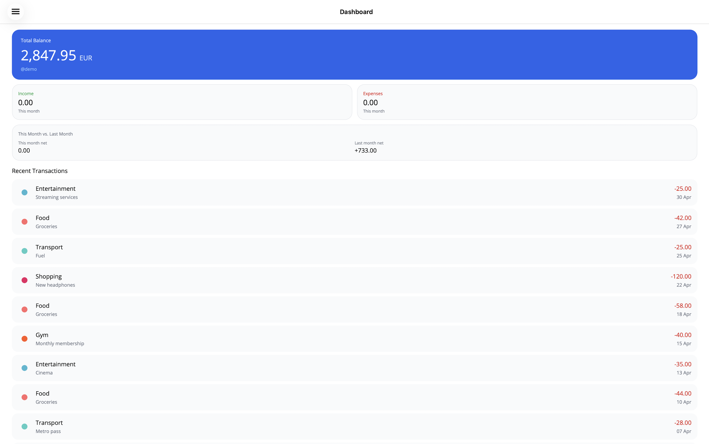
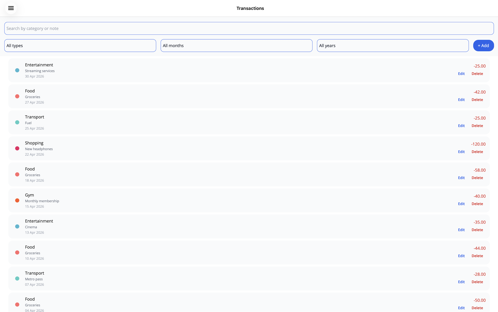
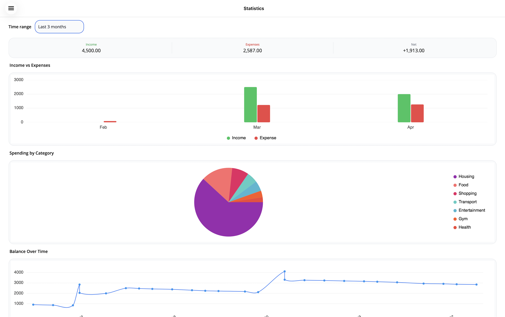
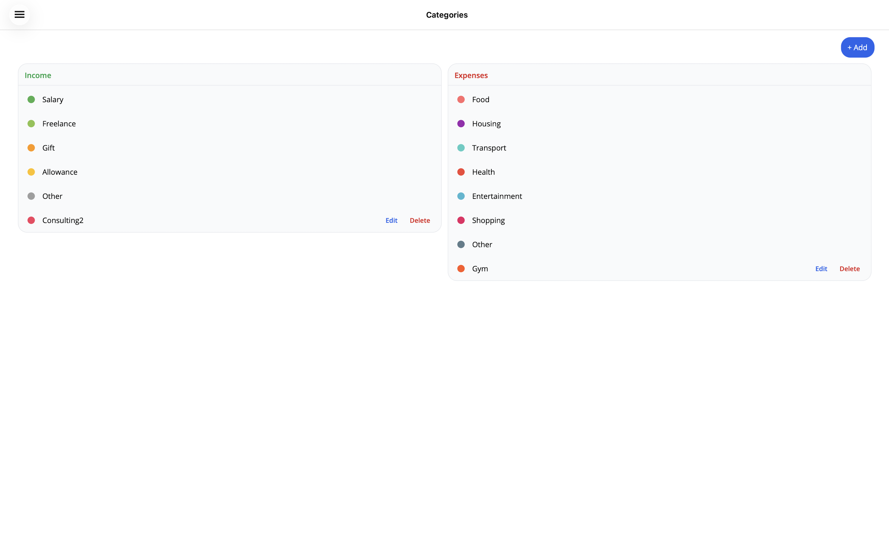
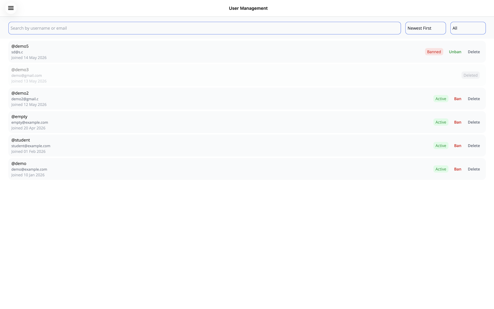
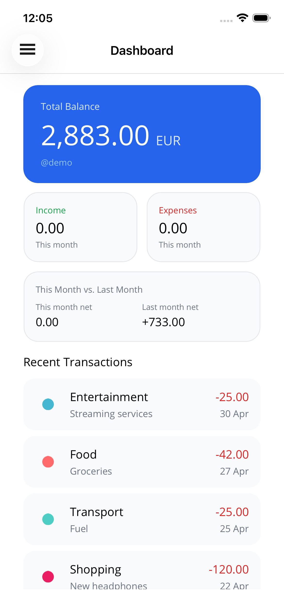
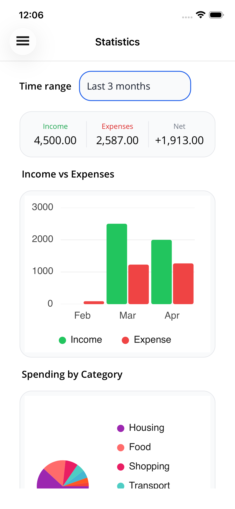

# Personal Budget Tracker

A personal finance management app built with .NET MAUI. Tracks income and expenses, visualizes spending with charts, and includes an admin panel for user management.

## Screenshots

<table>
  <tr>
    <td></td>
    <td></td>
  </tr>
  <tr>
    <td></td>
    <td></td>
  </tr>
  <tr>
    <td></td>
    <td>
      
      
    </td>
  </tr>
</table>

## Tech stack

- **.NET 10 MAUI** — Mac Catalyst + iOS
- **SQLite + EF Core** — local database with migrations
- **CommunityToolkit.Mvvm** — MVVM pattern (`[ObservableProperty]`, `[RelayCommand]`)
- **CommunityToolkit.Maui** — converters, popups
- **LiveCharts2** — bar, pie, and line charts on the Statistics page
- **MauiIcons.Material** — Material Design icons
- **BCrypt.Net** — password hashing

## Prerequisites

- .NET 10 SDK
- JetBrains Rider or Visual Studio 2022+ with MAUI workload

> Developed and tested on macOS (Mac Catalyst) and iOS simulator. The UI is fully responsive and works on both platforms.

## How to run

```bash
git clone https://github.com/KristofBajus/personal-budget-tracker.git
cd personal-budget-tracker/Project
open Project.sln          # or open in Rider / Visual Studio
```

Then build and run the `Project` target (Mac Catalyst or iOS Simulator). No extra steps needed — on first launch the app automatically:
1. Creates the SQLite database
2. Runs all EF Core migrations
3. Seeds the admin user and all demo accounts with sample data

## Features

- **Auth** — register, login, BCrypt password hashing; banned/deleted account messages
- **Dashboard** — current balance, income/expense summary cards, recent transactions list
- **Transactions** — full CRUD with category assignment, search, date and type filters
- **Categories** — manage personal income/expense categories with color picker; global categories are read-only
- **Statistics** — monthly income/expense bar chart, category breakdown pie chart, balance history line chart; time range selector
- **Profile** — update username, email, and password with inline validation
- **Theme** — Light/Dark toggle in sidebar; follows OS on launch, manual override per session
- **Admin panel** — system stats overview, user management with search/filter, ban/unban/delete actions

---

## Docs

- [Tech stack & decisions](docs/tech-stack.md)
- [Requirements](docs/requirements.md)
- [Screens](docs/screens.md)

---

## Demo accounts

All accounts are seeded automatically on first launch.

### Admin

| Username | Password    |
|----------|-------------|
| `admin`  | `Admin1234` |

**Shows:** Admin Overview (system stats) and User Management (ban/unban/delete users).

---

### demo — Working professional (EUR)

| Username | Password   | Currency |
|----------|------------|----------|
| `demo`   | `Demo1234` | EUR      |

**Shows:**
- Dashboard with ~2 883 EUR balance
- 35 transactions across Feb–Apr 2026 (salary, rent, food, transport, entertainment, gym, consulting)
- 2 custom categories: Consulting (income), Gym (expense)
- Statistics with 3 months of chart data

---

### student — Student on a budget (CZK)

| Username  | Password      | Currency |
|-----------|---------------|----------|
| `student` | `Student1234` | CZK      |

**Shows:**
- CZK currency throughout the app
- 18 transactions across Mar–Apr 2026 (allowance, rent, food, part-time job)
- 1 custom category: Part-time Job (income)
- Tighter income/expense ratio compared to `demo`

---

### empty — New user, no data (USD)

| Username | Password    | Currency |
|----------|-------------|----------|
| `empty`  | `Empty1234` | USD      |

**Shows:** empty states on Dashboard, Transactions, and Statistics pages.

---
